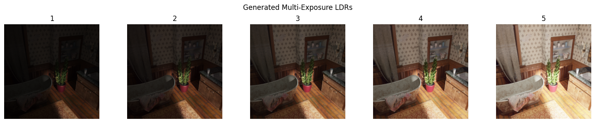
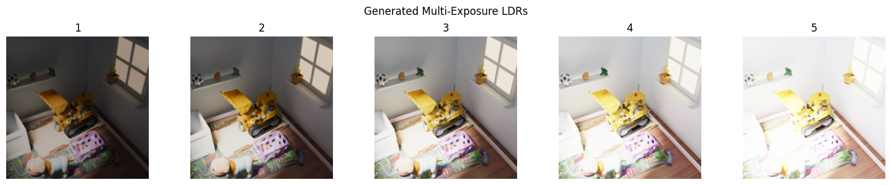

# HDR-GAN: Multi-Exposure HDR Image Generation

A Generative Adversarial Network for synthesizing multiple exposure images from a single LDR input using conditional adversarial training with heavy L1 reconstruction loss. This model is trained on multi-exposure HDRGS dataset with 5 exposure levels per scene.

## Installation

```
pip install -r requirements.txt
```

**requirements.txt:**
```
torch
torchvision
pillow
tqdm
torchmetrics
```

## Dataset Structure

```
dataset/
├── Scen1/
│   └── images/
│       ├── 0_0.png    # Scene 0, exposure 0 (darkest)
│       ├── 0_1.png    # Scene 0, exposure 1
│       ├── 0_2.png    # Scene 0, exposure 2 (middle)
│       ├── 0_3.png    # Scene 0, exposure 3
│       └── 0_4.png    # Scene 0, exposure 4 (brightest)
├── Scene2/
├── Scene3/
└── [Other Scenes]/
```

## Usage

### Training
```
# Basic training
python train.py --dataset ./path/to/dataset
```

### Inference
```
# Generate multi-exposure images from single LDR input
python main.py --image input.jpg --model generator.pth

# Use custom model checkpoint
python main.py --image input.jpg --model generator_epoch_50.pth
```

## Architecture

Our HDR-GAN employs a **conditional adversarial framework** for multi-exposure image synthesis:

**Generator** → Takes a single LDR image (middle exposure) and generates 5 exposure levels through encoder-decoder architecture. The encoder downsamples input (3→64→128 channels) while decoder reconstructs all exposure variants (128→64→15 channels), reshaped to (5 exposures × 3 RGB channels).

**Discriminator** → Evaluates realism of generated multi-exposure sequences by processing concatenated input-output pairs (18 total channels: 3 input + 15 generated). Uses PatchGAN-style convolutions with LeakyReLU activation for stable adversarial training.

**Training Strategy** → Combines adversarial loss with heavy L1 reconstruction loss (100× weighting) ensuring both realistic generation and pixel-accurate reconstruction of ground truth exposure sequences.

The pipeline processes: **Single LDR → Generator → 5 Exposure Levels → Discriminator Evaluation → Loss Computation**, optimizing both networks for faithful multi-exposure synthesis.

## Command Arguments

**Training:** `--dataset` (required)

**Inference:** `--image` (required), `--model` (default: "generator.pth")

## Results

Examples of multi-exposure generation from single LDR input using our HDR-GAN model:

| Input LDR | Generated Exposures |
|-----------|-------------------|
|  |   |
|  |  |

*From left to right: Darkest exposure (0) to Brightest exposure (4)*


## Author

**Tejas Thakare**  
GitHub: [TejasCThakare](https://github.com/TejasCThakare)  
LinkedIn: [tejas-t-722758204](https://www.linkedin.com/in/tejas-t-722758204)
```

